# Example of MaBoSS 2.5.0 use to simulate Montagud 2022 Prostate Cancer model

In this example we will use a newly published model by Montagud et al. ([eLife, 2022](https://elifesciences.org/articles/72626)).  This model contains 133 nodes, a large model describing the pathways involved in prostate cancer. The interaction graph of the model, colored by pathway, is shown in Fig.1.

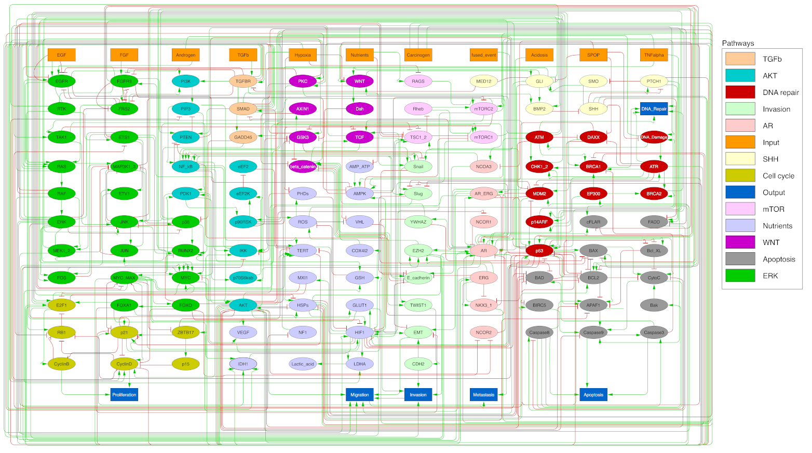

*Fig.1 Interaction graph of the Montagud et al. prostate cancer Boolean model.*

### Using command line

##### Installing MaBoSS
To simulate it, we first need to install MaBoSS, for example via colomoto conda package repository : 

    conda install -c colomoto maboss

Once installed, we need to use a version of MaBoSS supporting at least 133 nodes, such as MaBoSS_256n provided via the conda package. 

Alternatively, MaBoSS_256n can be compiled from source after downloading it from the official GitHub repository : 

    git clone https://github.com/sysbio-curie/MaBoSS-env-2.0
    cd engine/src
    make MAXNODES=256 install

To compile MaBoSS with SBML-qual compatibility, we need to add SBML_COMPAT=1 flag to the compilation command : 

    make MAXNODES=256 SBML_COMPAT=1

To compile MaBoSS with MPI compatibility, we need to add MPI_COMPAT=1 flag to the compilation command, and specify mpic++ as the compiler : 

    make MAXNODES=256 SBML_COMPAT=1 MPI_COMPAT=1 CXX=mpic++

To add MaBoSS_256 to the path, you then need to activate MaBoSS environment via :

    cd ../..
    source MaBoSS.env

##### Simulating the model
Then, to simulate the model, we can use the BND and CFG file provided in the supplementary files of the article, or via its github repository (https://github.com/ArnauMontagud/PROFILE_v2), by executing the following command line : 

    MaBoSS_256n -c Montagud2022_Prostate_Cancer.cfg Montagud2022_Prostate_Cancer.bnd -o results

Note that with the newly developed SBML-qual compatibility, we can also use the SBML model definition of the model by simply substituting it to the BND file : 

    MaBoSS_256n -c Montagud2022_Prostate_Cancer.cfg Montagud2022_Prostate_Cancer.sbml -o results

To use MaBoSS MPI capabilitiy, for example using two MPI nodes, you need to run MaBoSS (correctly compiled with MPI flag) via mpirun, as such : 

    mpirun -np 2 MaBoSS_256n -c Montagud2022_Prostate_Cancer.cfg Montagud2022_Prostate_Cancer.sbml -o results

##### Raw result files

This will produce several result files. The first one results_fp.csv, a list of all the fixed points encountered during the simulation. In the case of this model, we encountered a very large number of fixed points (1758). In Fig.2 we show a snapshot of the file were we can see the number of fixed points, and then the list of all the fixed points, with their probability, the full state description using all nodes, and then the boolean value of each node. 

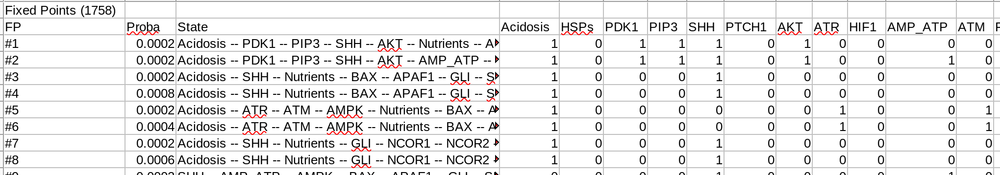

*Fig.2 Snapshot of the first line and columns of the results_fp.csv file, containing the fixed points encountered in the simulation.*

The second file, results_probtraj.csv contains the probability trajectories. In this case the results are simpler, as most of the nodes are declared as internal and thus the results only contain a small set of external (output) nodes. The probability trajectories contain first of all the value of the time point, followed by the trajectory entropy, error trajectory entropy, the global entropy and the hamming distance (for more information on those, please refer to MaBoSS publication). We then have a list of State, Probability, and Error for any state encountered at that time point. 

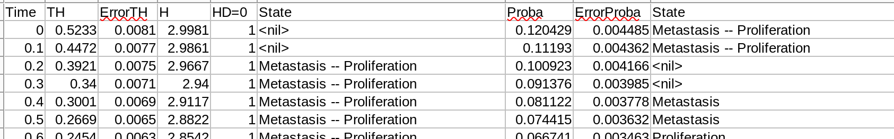

*Fig.3 Snapshot of the first lines and columns of the results_probtraj.csv file, containing the probability trajectories.*

The last file, results_statdist.csv, is related to the stationary distributions results, and is out of the scope for this example. All these raw results files can then be analyzed using custom scripts. Example of such scripts and their usage is available at https://maboss.curie.fr.

However, a simpler solution is to use the python bindings to be able to perform the simulations, but more importantly easily visualize results. 

### Using pymaboss, MaBoSS’ python bindings

##### Installing pyMaBoSS
To simulate models with pymaboss, you first need to install it, for example using conda : 

    conda install -c colomoto pymaboss

Alternatively, if you already have MaBoSS installed, you can install pyMaBoSS from PyPi using :
    pip install maboss

##### Simulating model
Then, in a python command line, you first need to import maboss : 

    import maboss

And then import the model : 

    model = maboss.load("Montagud2022_Prostate_Cancer.bnd","Montagud2022_Prostate_Cancer.cfg")

Again, note that the model can also be imported using the SBML file provided, with the following command : 

    model = maboss.loadSBML("Montagud2022_Prostate_Cancer.sbml","Montagud2022_Prostate_Cancer.cfg")

Once loaded, the model can be simlated as such : 

    result = model.run()

Once executed, we can plot the distributions of the final states of the model (the last time point of the result_probtraj.csv file), using : 

    result.plot_piechart()

And obtain the Fig. 4. Note that we can only see the states composed of the nodes declared as external nodes. 

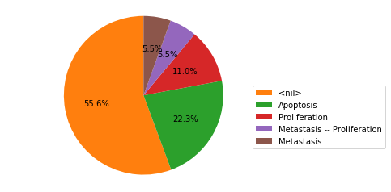

*Fig. 4 Final states distributions of Montagud et al. Prostate cancer model using default conditions.*

We can also plot the complete trajectories using :

    result.plot_trajectory()

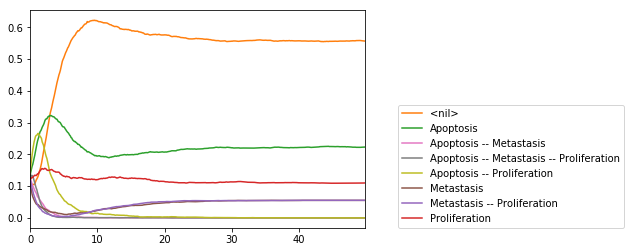

*Fig. 5 Probability distribution trajectories of Montagud et al. Prostate cancer model using default conditions.*

Finally, we can also obtain probability trajectories as pandas dataframes, using : 

    data = result.get_states_probtraj()

And example of the first lines of the dataframe is showed in Fig. 6. This allows to use the pandas library to perform further data analysis on the results.

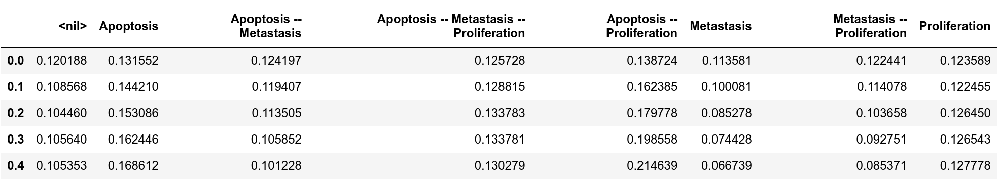

*Fig. 6 Probability trajectories as a panda dataframe*

MaBoSS python bindings offer more possibility which are presented in their documentation, available at https://pymaboss.readthedocs.io/.

### Using WebMaBoSS

Finally, we can also simulate the model using the newly developed web interface available at https://maboss.curie.fr/webmaboss/.

First, we need to create a specific project, or use an existing one. Once in the project, we can import the model using the Load model interface, informing a name, choose the model type as MaBoSS, and select the BND and the CFG file of the model, and finally load the model into the project (Fig. 7). 

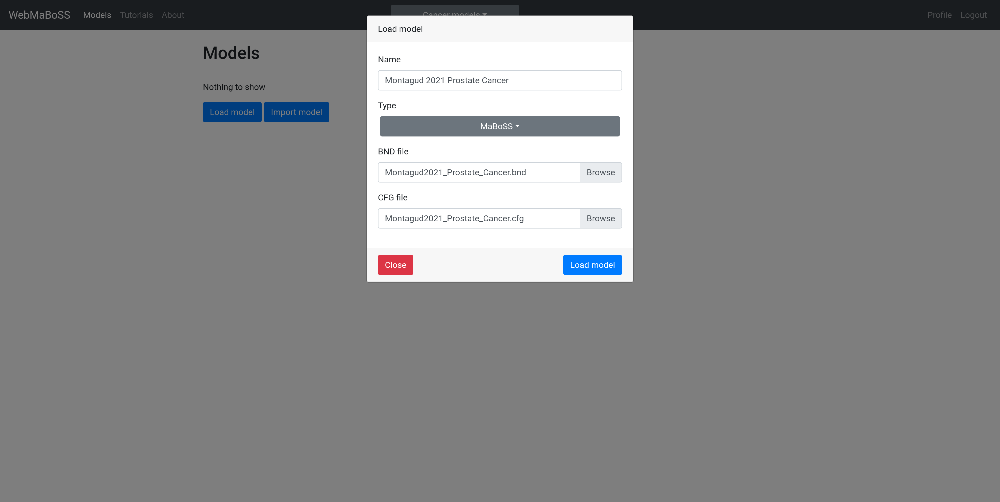

*Fig. 7 Loading the model into WebMaBoSS*

Once loaded, we can click on the model, select the Simulation menu, and create a new simulation. Here we have the possibility to change simulations settings, or just simulate with default settings using the Submit button (Fig. 8). 

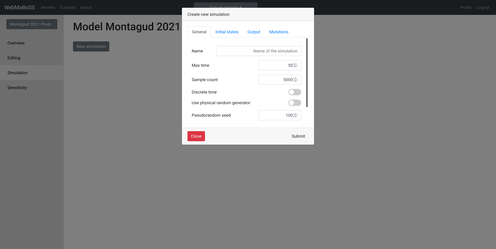

*Fig. 8 Creating a new simulation*

Once executed, the results will be immediately visualized. The first type of results will be the final state of the simulation (Fig. 9). The states probability trajectories will be available via a dedicated tab (Fig. 10), as well as the nodes probability trajectories (Fig. 11) and the list of fixed points (Fig. 12). 

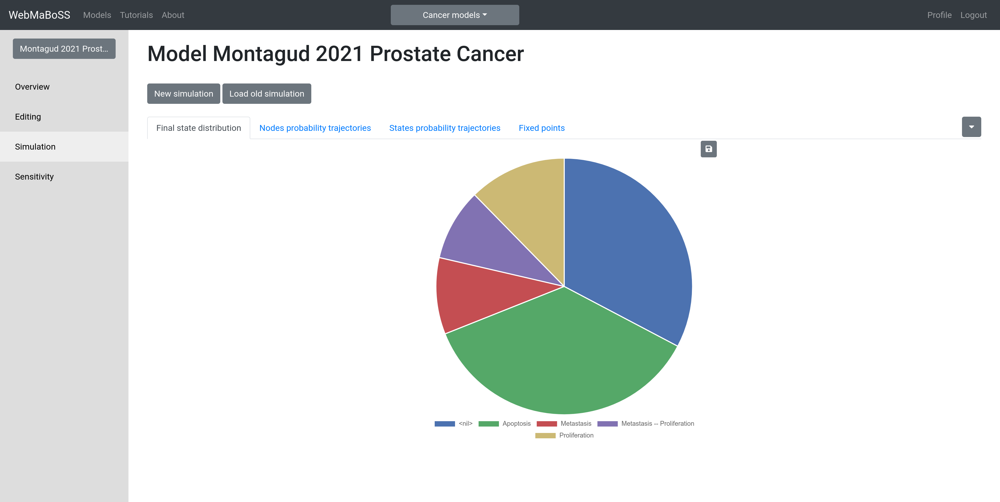

*Fig. 9 Visualization of final states distributions*

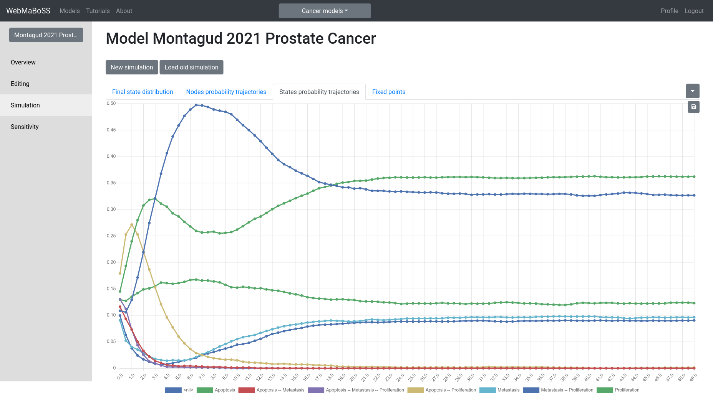

*Fig. 10 Visualization of states distribution trajectories*

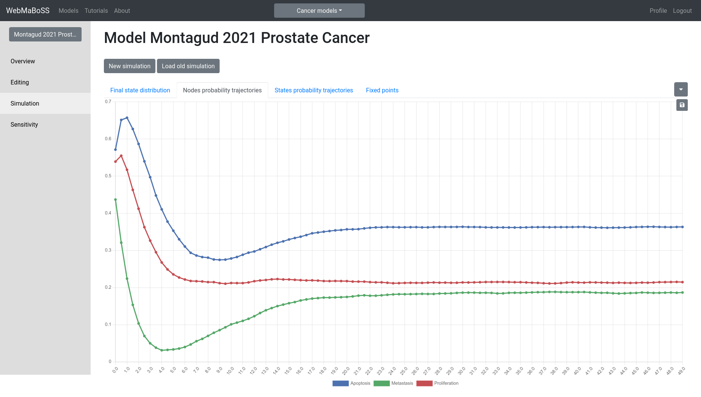

*Fig. 11 Visualization of nodes distribution trajectories*

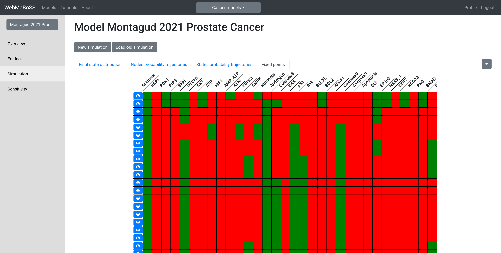

*Fig. 12 Visualization of fixed points*